# 百度之星初赛3
昨天刚做的初赛2，好像做的大佬不多；作出了两个题排名600多，据说可以进复赛了；
周末的比赛就是男人的浪漫了，烈日当头，不如刷刷题。

## 第一题，Discount
看第一题之前我大致看了所有题，感觉第7题可以做，我还花了点时间去看了看，最后看了波提交情况，看大家都AC了第一题，我才从头开始看。。。
题目：


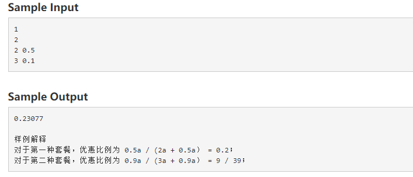

题意：题目很简单，样例说的很清楚。
```
#include <bits/stdc++.h>
using namespace std;
int t;
int b[100 + 5];
double c[100 + 5];
int main() {
    scanf("%d", &t);
    while (t-- != 0) {
        int n;
        scanf("%d", &n);
        memset(b, 0, sizeof(b));
        memset(c, 0, sizeof(c));
        double result = 0.0;
        for (int i = 0; i < n; i++) {
            scanf("%d %lf", &b[i], &c[i]);
            result = max(result, (1.0 - c[i])/(b[i] + 1.0 - c[i]));
        }
        printf("%.5f\n", result);
    }
    return 0;
}

```

## 第二题，Game
题目：
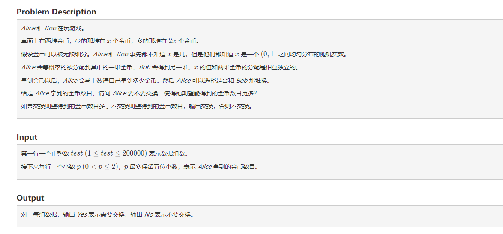
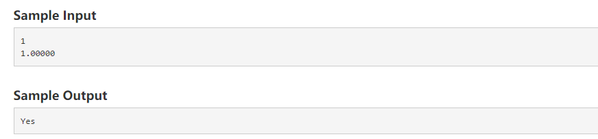

题意：这题也很简单，主要是double精度考虑就行。
```
#include <bits/stdc++.h>
using namespace std;
int t;
const double eps = 1e-8;
int main() {
    scanf("%d", &t);
    while (t-- != 0) {
        double p;
        scanf("%lf", &p);
        if ((p - 1.00000) > eps) {
            printf("No\n");
        }
        else {
            printf("Yes\n");
        }

    }
    return 0;
}

```

## 第三题，Permutation
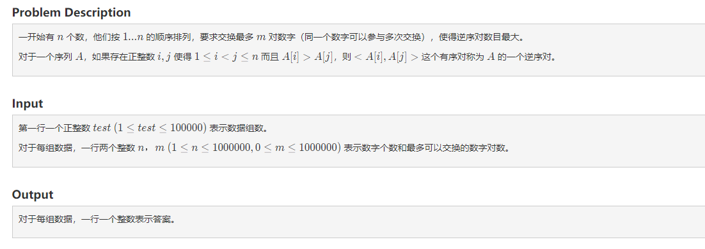
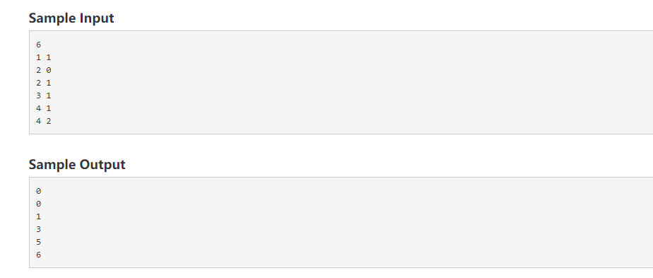

题意：这个题我提交了好几次，一直超时；其实这个就是个数论，规律题。要根据n/2的来判断，大于n/2的逆序对数目就是把整个序列倒着排序后所有的逆序对数目。其次看规律，
比如
1 2 3 4 5,
如果m大于n/2，最后的序列就是5 4 3 2 1 , 数目就是 5 * 4 / 2 = 10;
如果m小于等于n/2，比如m = 1，那么我们采用的策略就是最大的和最小的交换，依次往中间靠近。交换后就是5 2 3 4 1, 那么数量就是（5 4 3 2 1 序列的数目）减去 （2 3 4 序列的数目），有没有发现规律，（2 3 4）的数目计算就是3*2/2 = 3; 所以最后一共就是 10 - 3 = 7；

```
#include <bits/stdc++.h>
using namespace std;
typedef long long ll;
int t;
int main() {
    scanf("%d", &t);
    while (t-- != 0) {
        long long n, m;
        scanf("%lld%lld", &n, &m);
        int mid = n/2;
        if (m >= mid) {
            printf("%lld\n", n*(n-1)/2);
        } else {
            long long k = n - m*2;
            printf("%lld\n", (n*(n-1)/2 - k*(k-1)/2));
        }
    }
    return 0;
}

```

## 第四题，Intersection
AC了三个题，感觉差不多了可以进前1000，后面的题应该就会难一点把；然后我先看了一下第四题，然后看了一下图，对着样例看了看，其实，也是一个数论题，找规律，因为提交之前我是抱着试一试的，竟然AC了，果然！！！数学需要大胆猜想。
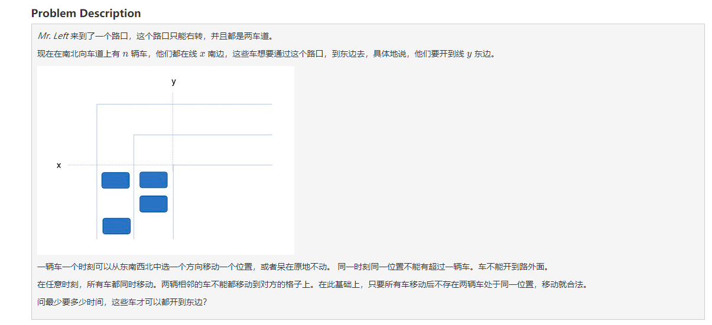
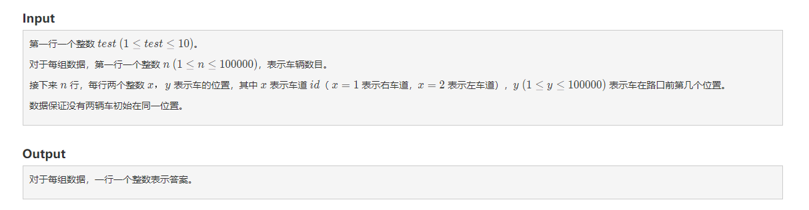
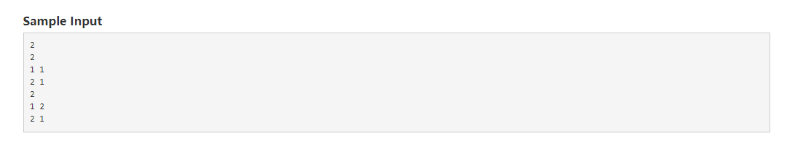
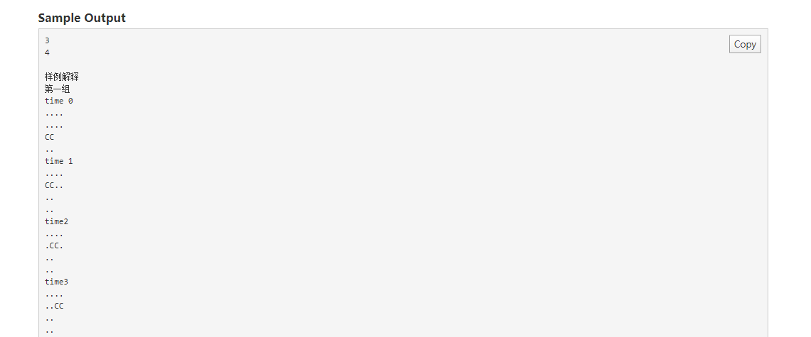
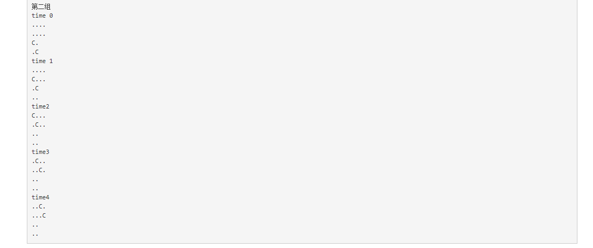


```
#include <bits/stdc++.h>
using namespace std;
int t, n;
const double eps = 1e-8;
int visited[100000 + 10];
int visited2[100000 + 10];
int main() {
    scanf("%d", &t);
    while (t-- != 0) {
        memset(visited, 0, sizeof(visited));
        int result = 0;
        scanf("%d", &n);
        for (int i = 0; i < n; i++) {
            int x, y;
            scanf("%d %d", &x, &y);
            if (x == 1) {
                result = max(result, y + x);
                visited[y] = 1;
            } else {
                if (visited[y+1] == 1) {
                    result = max(result, 2 + y + 1);
                } else {
                    result = max(result, y + x);
                }
            }
        }
        printf("%d\n", result);
    }
    return 0;
}

```


## 第七题 fight 

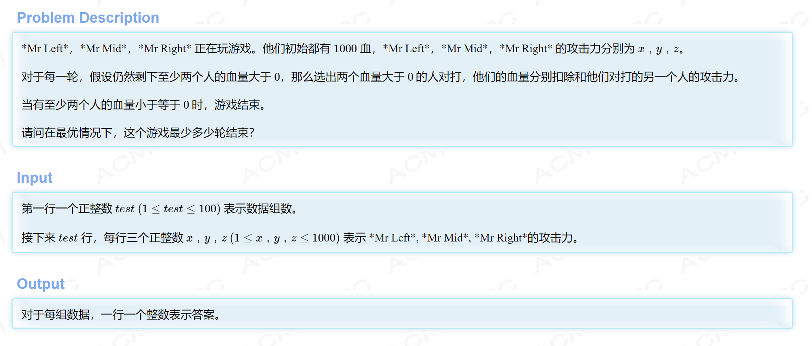
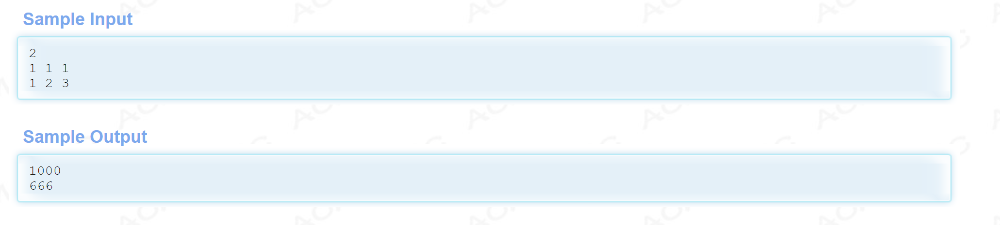


HDU链接：
http://acm.hdu.edu.cn/showproblem.php?pid=6789

题意：思路，暴力枚举；优化1，在最里面一层找到大于1000的组合以后，break;优化2，三个人的攻击力相等的情况分开讨论；实测，速度都有了很明显的提升，时间从500多毫秒提升到了78毫秒；


```
#include <bits/stdc++.h>
using namespace std;
int t;
int a[3];
int main() {
    scanf("%d", &t);
    while (t-- != 0) {
        scanf("%d %d %d", &a[0], &a[1], &a[2]);
        if (a[0] == a[1] && a[0] == a[2] && a[1] == a[2]) {
            int k = 1000/a[0];
            if (1000%a[0] != 0) k++;
            printf("%d\n", k);
        } else {
            sort(a, a + 3);
            int x = a[1], y = a[2], z = a[0];
            int sx = 1000 / x + (1000 % x != 0);
            int sy = 1000 / y + (1000 % y != 0);
            int sz = 1000 / z + (1000 % z != 0);
            int ans = 3000;
            for (int i = 0; i <= min(sx, sy); i++) {// ab打i次
                for (int j = 0; j <= min(sx, sz); j++) { // ac打j次
                    int dama = y * i + j * z;
                    for (int k = 0; k <= min(sy, sz); k++) {// bc打k
                        int damb = i * x + k * z;
                        int damc = j * x + k * y;
                        int cnt = 0;
                        if (dama >= 1000) cnt++;
                        if (damb >= 1000) cnt++;
                        if (damc >= 1000) cnt++;
                        if (cnt >= 2) {
                            ans = min(ans, i + j + k);
                            break;
                        }
                    }
                }
            }
            printf("%d\n", ans);
        }
    }
    return 0;
}
```
